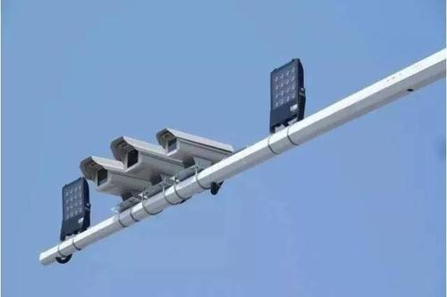
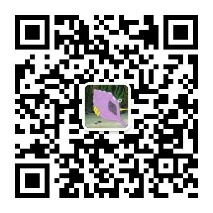
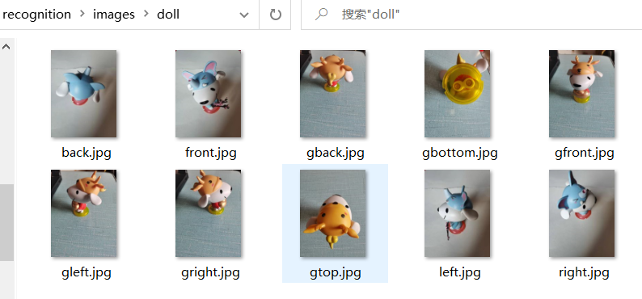
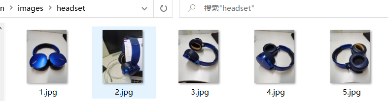
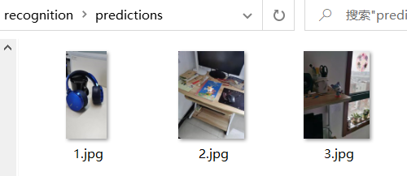
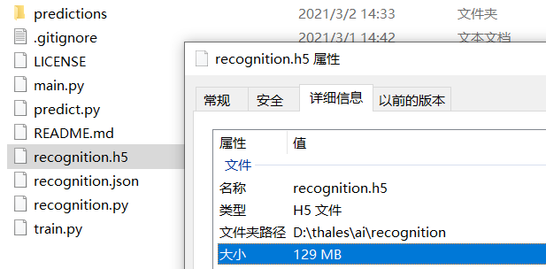

# 图像识别


人工智能，有些比较虚，但是图像识别这是我们每天都在用的内容


比如：人脸识别，交通违章拍照(网络图片，侵删)





就算那些你都没用过，扫描二维码总用过把





# 工作原理


为了让大家都明白，这里用最简单的方式介绍，目的是谁都能完成图片识别


## 源码

- github: https://github.com/thales-ucas/recognition
- gitee: https://gitee.com/thales-ucas/recognition


## 配置文件


我们有个配置文件


train下面是一个数组


```json
{
  "model": "recognition.h5",
  "train": [
    {
      "label": "玩偶",
      "path": "./images/doll"
    },
    {
      "label": "耳麦",
      "path": "./images/headset"
    }
  ]
}
```


## 图片和标签

- path: 放置图片的路径
- label: 这些图片的标签


其实就是一堆图片，他们都是一个标签


比如**玩偶**的路径是``` ./images/doll ```





这里面放满了 **玩偶** 的图片


你认识 **玩偶** ，应该就是看了很多 **玩偶** (图片)，就可以理解 **玩偶** 的特征了，之后看到新的物件(照片)也会判断是不是 **玩偶** 了


人工智能同理，**人工智能** 也去多看 **玩偶** ，然后就可以识别了，理论上，看的越多，识别越准


我们多建几个标签就可以识别更多东西了，比如 **耳麦**





## 识别


我写了一个 **Recognizer** 类，加载之后，只用3行代码就可以识别```./predictions/```目录内的图片





```py
# main.py
from recognition import Recognizer

recognizer = Recognizer('./recognition.json')
recognizer.train()
recognizer.predict('./predictions/')
```


看看结果


```
图片 (./predictions\1.jpg) 是 (耳麦)
图片 (./predictions\2.jpg) 是 (玩偶)
图片 (./predictions\3.jpg) 是 (玩偶)
```


## 保存模型


上面的识别，恐怕用了好久，主要是 **训练(train)** 的时间长，也好理解，你学会认一类事物(图片)可能也花很多时间啊


但是不能每次想识别新的图片都用重新训练一下把，所以我们可以保存模型(训练好的)，就等于你把特征记录了下来


```py
# train.py
from recognition import Recognizer

recognizer = Recognizer('./recognition.json')
recognizer.train()
recognizer.save()
```


这样我们保存了一个```recognition.h5```的模型文件





## 读取模型


有了刚才保存的模型，我们下次只要读取这个模型，就不需要再训练了，直接识别


```py
# predict.py
from recognition import Recognizer

recognizer = Recognizer('./recognition.json')
recognizer.load()
result = recognizer.predict('./predictions/')
print(result)
```


我专门用json输出，方便其他接口调用


```json
[{'img': './predictions\\1.jpg', 'label': '耳麦'}, {'img': './predictions\\2.jpg', 'label': '玩偶'}, {'img': './predictions\\3.jpg', 'label': '玩偶'}]
```

# recoginzer类


识别类，有基础的童鞋可以详细看一下，只有100多行代码


如果只想自己试试看图像识别，完全不用管下面的代码，自己再创造几个 **训练(train)** 目录，然后放几个图片在```predictions```目录里试试看就行了


```py
#!/usr/bin/env python
# -*- coding: utf-8 -*
"""
图像识别类，读取json文件，然后按照里面的图片去训练，最后可以完成图像识别
"""
import glob # 用于查询符合特定规则的文件路径名
import os # 处理文件和目录
import cv2  # 用于图像处理
import json # json
import tensorflow as tf # 主要用内置的激活函数
from tensorflow.keras import layers, optimizers, datasets, Sequential  #从tensorflow.keras模块下导入layers，optimizers, datasets, Sequential等方法
from tensorflow.keras.models import save_model, load_model # keras的模型保存以及加载
import numpy as np  #导入numpy数据库
from sklearn.model_selection import train_test_split   #从sklearn.model_selection模块导入train_test_split方法，用于拆分数据集
class Const:
  """
  常量
  """
  class ConstError(TypeError):pass
  def __setattr__(self, name, value):
    if name in self.__dict__:
      raise self.ConstError("Can't rebind const (%s)" %name)
    self.__dict__[name]=value

IMG = Const()
IMG.w = 100 #设置图片宽度为100
IMG.h = 100 #设置图片高度为100
IMG.c = 3 #设置图片通道为3
IMG.seed = 1  # 设置随机数种子，即seed值

class Recognizer:
  '''
  识别器
  '''
  def __init__(self, url):
    self.model = None # 模型
    self.conf = json.load(open(url, "r", encoding='utf-8'))
  def train(self):
    '''
    训练
    '''
    data = []
    label = []
    for idx, obj in enumerate(self.conf["train"]):
      imgs = self.loadImagesByPath(obj["path"])
      for img in imgs:
        label.append(idx)
        data.append(img)
    data = np.asarray(data, np.float32) # 转化数组数据，转成浮点类型
    label = np.asarray(label, np.int32)  # 转化数组数据，转成整数类型
    np.random.seed(IMG.seed)   # 保证生成的随机数具有可预测性,即相同的种子（seed值）所产生的随机数是相同的
    (x_train, x_val, y_train, y_val) = train_test_split(data, label, test_size=0.20, random_state=IMG.seed) #拆分数据集
    x_train = x_train / 255  #训练集图片标准化
    x_val = x_val / 255      #测试集图片标准化
    self.model = Sequential([ 
      layers.Conv2D(32, kernel_size=[5, 5], padding="same", activation=tf.nn.relu), #调用layer.Con2D()创建了一个卷积层。32表示kernel的数量。kernel大小是5*5，padding=“same”表示填充输入以使输出具有与原始输入相同的尺寸，使用RELU激活函数
      layers.MaxPool2D(pool_size=[2, 2], strides=2, padding='same'),  #调用layers.MaxPool2D()创建最大池化层，池化核大小为2*2，步长为2，padding=“same”表示填充输入以使输出具有与原始输入相同的尺寸。
      layers.Dropout(0.25), #利用dropout随机丢弃25%的神经元

      #继续添加两个卷积层和一个最大池化层，并使用dropout，增强网络泛化性能
      layers.Conv2D(64, kernel_size=[3, 3], padding="same", activation=tf.nn.relu),
      layers.Conv2D(64, kernel_size=[3, 3], padding="same", activation=tf.nn.relu),
      layers.MaxPool2D(pool_size=[2, 2], strides=2, padding='same'),
      layers.Dropout(0.25),

      # 继续添加一个卷积层和一个最大池化层，并使用dropout，增强网络泛化性能
      layers.Conv2D(128, kernel_size=[3, 3], padding="same", activation=tf.nn.relu),
      layers.MaxPool2D(pool_size=[2, 2], strides=2, padding='same'),
      layers.Dropout(0.25),
    
      layers.Flatten(), #Flatten层用来将输入“压平”，即把多维的输入一维化
      layers.Dense(512, activation=tf.nn.relu), #调用layers.Dense()创建全连接层，使用512个神经元
      layers.Dense(256, activation=tf.nn.relu), #调用layers.Dense()创建全连接层，使用256个神经元  
      layers.Dense(6, activation='softmax') #添加全连接层，最后输出每个分类的数值，因为图像有6个类别，所以使用6个神经元
    ])
    opt = optimizers.Adam(lr=0.0001)   #使用Adam优化器，优化模型参数。lr(learning rate, 学习率)
    #编译模型以供训练。使用多分类损失函数'sparse_categorical_crossentropy'，使用metrics=['accuracy']即评估模型在训练和测试时的性能的指标，使用的准确率。
    self.model.compile(optimizer=opt, 
                      loss='sparse_categorical_crossentropy',
                      metrics=['accuracy'])
    #训练模型，决定训练集和验证集，batch size：进行梯度下降训练模型时每个batch包含的样本数。
    #verbose：日志显示，0为不在标准输出流输出日志信息，1为输出进度条记录，2为每个epoch输出一行记录
    self.model.fit(x_train, y_train, epochs=30, validation_data=(x_val, y_val),batch_size=200, verbose=2)
    self.model.summary() #输出模型的结构和参数量
  def predict(self, folder):
    '''
    预测
    @param  {string}  folder 图片地址
    '''
    imgs = []
    data = []
    for im in glob.glob('%s/*.jpg' % folder):
      imgs.append(im)
      img = cv2.imread(im)
      img = cv2.resize(img, (IMG.w, IMG.h))
      data.append(img)
    data = np.asarray(data, np.float32)
    prediction = self.model.predict_classes(data)
    for i in range(np.size(prediction)):
      print("图片 (%s) 是 (%s)" % (imgs[i], self.conf["train"][prediction[i]]['label']))
  def loadImagesByPath(self, folder):
    '''
    读取路径下所有图片
    @param  {string}  folder  图片所在目录
    '''
    arr = []
    for im in glob.glob("%s/*.jpg" % folder): # 利用glob.glob函数搜索每个层级文件下面符合特定格式“/*.jpg”的图片，并进行遍历
      img = cv2.imread(im)  # 利用cv2.imread函数读取每一张被遍历的图像并将其赋值给img
      img = cv2.resize(img,(IMG.w, IMG.h)) # 利用cv2.resize函数对每张img图像进行大小缩放，统一处理为大小为w*h(即100*100)的图像
      arr.append(img)
    return arr
  def save(self, h5py=None):
    '''
    保存模型
    '''
    if h5py == None:
      h5py = self.conf['model']
    self.model.save(h5py)
  def load(self, h5py=None):
    '''
    读取模型
    '''
    if h5py == None:
      h5py = self.conf['model']
    self.model = load_model(h5py)
__all__ = ('Recognizer')
```